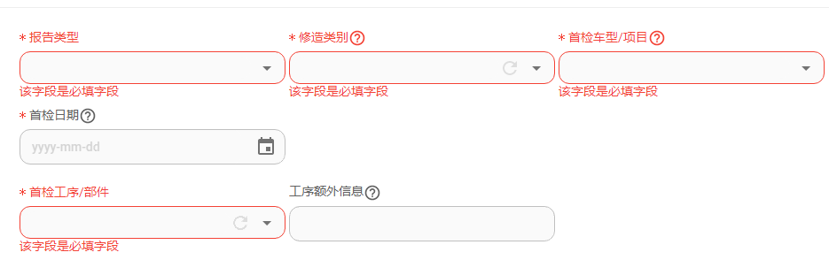

# @iimm/formily-mui

[](https://npmjs.org/package/@iimm/formily-mui)
[](https://npmjs.org/package/@iimm/formily-mui)

## 简介

封装了一些常用的@mui/material的表单组件，使用了formily进行表单数据绑定。

参考了antd4的部分布局啥的，水平有限，主要是自己用。

## Install

```bash
npm install @iimm/formily-mui
```

## 表单组件
- 封装了2个常用的表单用途组件：ModalForm、StepsForm。
- 常用的重置和提交按钮：Reset、Submit


## 表单布局组件
 - 参考antd布局封装了一个简单的表单字段布局字段：FormItem（及不用于表单的FormItemBase），用于统一表单字段的布局：标签和错误提示的位置等,见下图。



FormItemBase可以用于在表单中展示其他内容以外观与表单一致：

```typescript
const demo =() => (
  <>
    <FormItem label="姓名" fullWidth showFeedback >
     要展示的内容
    </FormItem>
  <>
)
```

- 一个表单布局组件，用于字段间布局，是一个Grid布局组件：FormLayout,可以设置栅格布局。并能给所有field组件传递fullWidth、showFeedback、withFormItem等属性。

## 表单字段组件
使用formily封装了很多常见的@mui组件的表单组件，所有表单组件包含base（如SelectBase）和表单field（如Select）两个版本，其中field版本是在base组件上进行了高阶封装，配合@formily/react的Field使用可以响应式获取field相关属性值,如果不配合formily使用，可以直接使用base版本，当然，field版本也可以使用。

这些字段组件都包裹了FormItemBase组件，并接受相关props

### 字段组件类型

包含字段类型： Input、Select、CheckboxGroup、RadioGroup、Switch、DatePicker、TimePicker、DateTimePicker、Upload、KeyWords、Transfer、ToggleButtonGroup

## 简单示例

### 普通表单

```typescript
import {useMemo, useCallback} from 'react';
import {createForm} from '@formily/core';
import {Field, FormProvider} from '@formily/react';
import {Select, Submit, Reset, DatePicker, FormLayout} from '@iimm/formily-mui';
import dayjs from 'dayjs';

/** Select的选项可以传入字符/数字/{value:any,label:ReactNode}类型的数组或返回这种数组的函数 */
const type2OptionsGetter = () => {
  return ['A','B',{value:'c',label:'选项C'}];
}

const Demo = () => {
  const form = useMemo(() => createForm(), []);
  const onSubmit = useCallback((values) => {
    // Todo
  },[])

  return (
    <>
      <FormProvider form={form}>
        <FormLayout xs={12} sm={6} xl={4} fullWidth showFeedback withFormItem>
          <Field 
            name='type'
            title='报告类型'
            required
            component={[Select,{options:['A','B',{value:'c',label:'选项C'}]}]}
          /> 
          <Field 
            name='type2'
            title='修造类型'
            description='这是一个提示tooltip'
            required
            component={[Select,{options:type2OptionsGetter}]}
          />
          <Field 
            name='date'
            title='首检日期'
            description='这是一个提示tooltip'
            required
            component={[DatePicker,{maxDate: dayjs()}]}
          />
        </FormLayout>
        <Reset />
        <Submit onSubmit={onSubmit} />
      </FormProvider>
    </>
  )
}
```

### 弹窗表单

ModalForm支持使用trigger属性来传入一个ReactNode作为trigger，点击它用于控制表单的打开。也可以使用open、setOpen的受控属性来控制表单的打开和关闭。

onFinish如果返回true则会自动关闭表单，false不会关闭。

```typescript
import {ModalForm, Select, Submit, Reset, DatePicker, FormLayout} from '@iimm/

const Demo = () => {

  const onFinish = (values)=>{}

  return (
    <ModalForm title='新建报告' trigger='点我' onFinish={onFinish}>
      <FormLayout xs={12} sm={6} xl={4} fullWidth showFeedback withFormItem>
            <Field 
              name='type'
              title='报告类型'
              required
              component={[Select,{options:['A','B',{value:'c',label:'选项C'}]}]}
            /> 
            <Field 
              name='type2'
              title='修造类型'
              description='这是一个提示tooltip'
              required
              component={[Select,{options:type2OptionsGetter}]}
            />
            <Field 
              name='date'
              title='首检日期'
              description='这是一个提示tooltip'
              required
              component={[DatePicker,{maxDate: dayjs()}]}
            />
        </FormLayout>
    </ModalForm>
  )
}
```

## LICENSE

MIT
